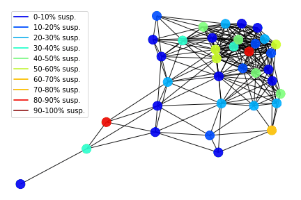

# COVID OUT!
This repository contains a implementation of graph informational spreading model
which simulates an illness propagation. Data is being generated in silulation of 
 interactions between people. Internal states of people are being described by 
 significant symptoms of CoVid19 ilness. This model has been developed after
 medical consultations and it is an entry for machine learning pipeline (after
 feeding with real data).
 
DOCUMENTATION IS [HERE](https://anty-filidor.github.io/covidout/#)

### Structure of repository

├── data_generation  
│   ├── databases.example.json  
│   ├── fill_database.py  
│   ├── gen_database.py  
│   ├── gen_graphs.py  
│   ├── graphs  
│   ├── names  
│   ├── simulation.py  
│   └── visualize_movement_simulation.py  
├── networks  
│   ├── edg2.csv  
│   ├── experiment.gif   
│   └── nod2.csv  
├── readme.md  
└── spreading_model  
    ├── ioops.py  
    ├── spreading.py  
    ├── src.ipynb  
    └── visualisations.py  

## How to run this code  

### Data generation
Algorithms to simulate human population inside city.
There are 3 scripts to be run:
* gen_database.py: It generates database files in csv format
* fil_database.py: It fills main sql database with generated data. 
Please use databases.json file to enter credentials. 
There is databases.example.json for reference
* gen_graphs.py: It generates data for graph analisis.

Also this framework contains all the classes to parse info in database for further analysis

### Spreading model
Please use `src.ipynb` notebook to perform an experiment. It contains 
* read of network
* experiment
* saving results as json of internal states of nodes or gif: 

  

Model is based on an observation, that its hard to distinguish between common flu and 
coronavirus. So instead of trying to predict coronavirus, we are tracking spread of any 
flu (ie. we create probabilistic chain of infections - who infected who). Then if one person 
from such a network is somehow diagnosed with coronaviurs, we can use this information to 
spread risks through is "flu symptoms" network. 

To build graph structure, we are using information from the GPS / location services. Connection weights
are based on time that 2 people spent in near proximity. 
Then to calculate risks, we use a conditional probabilities of coronavirus conditioned by symptoms 
(see `ioops.py_comp_internal_weights`) that user provided in the app and facts / probabilities of
coronavirus being diagnosed in his network.

To sum up, model consists of 2 components:
- internal probability of being infected by each neighbour node. This function is a sigmoid of
 13 different medical symptoms (see `ioops.py_comp_internal_weights`)
- external probability of illness transfer  by interpersonal contact. It is
stored in edges of graph model.
From hat coefficients a resultant probability is being computed by using
conditional probability laws.
